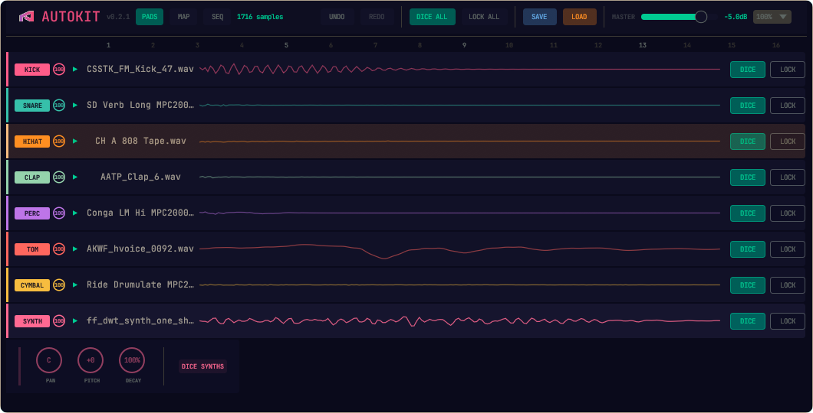
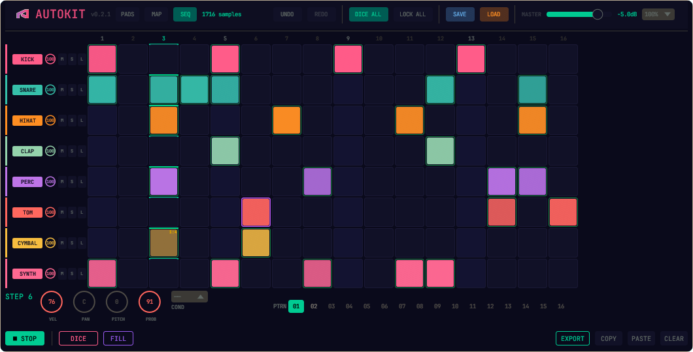

# Autokit

A sample-based drum machine plugin that scans your library, classifies oneshots by type (kick, snare, hihat, etc.) using spectral analysis, and plots them on an interactive 2D map. Assign samples to pads, sequence with a Digitakt-style step sequencer, and randomize kits with dice.

**Formats:** VST3, CLAP, Standalone
**Platforms:** Linux, macOS, Windows
**License:** GPL-3.0-or-later





## Quick start

Download the latest build for your platform from the [Releases](https://github.com/Hornfisk/autokit/releases/latest) page, extract, and run the installer:

```bash
# Linux / macOS
./install.sh

# Windows (run as Administrator)
install.bat
```

Rescan plugins in your DAW. Autokit appears as **REXIST / Autokit**.

Place your oneshot samples (WAV, FLAC, OGG) in `~/Music/Samples`. Autokit scans this folder on first launch and caches the results.

## Download

| Platform | File |
|----------|------|
| Linux x86_64 | `autokit-linux-x86_64.tar.gz` |
| macOS ARM (Apple Silicon) | `autokit-macos-arm64.tar.gz` |
| macOS Intel | `autokit-macos-x86_64.tar.gz` |
| Windows x86_64 | `autokit-windows-x86_64.zip` |

Each archive contains the standalone binary, plugin library, and install script.

### Verify download

Each release includes `SHA256SUMS.txt`:

```bash
# Linux / macOS
sha256sum -c SHA256SUMS.txt

# Windows (PowerShell)
Get-Content SHA256SUMS.txt | ForEach-Object {
  $hash, $file = $_ -split '\s+'; $actual = (Get-FileHash $file -Algorithm SHA256).Hash.ToLower()
  if ($actual -eq $hash) { "$file OK" } else { "$file FAILED" }
}
```

You can also upload binaries to [VirusTotal](https://www.virustotal.com/) to scan before running.

### macOS setup

The binaries are not codesigned or notarized, so macOS will block them on first launch. Here's how to get running:

**1. Extract the archive**

Double-click the `.tar.gz` file in Finder — it extracts automatically. Or in Terminal:

```bash
tar xzf autokit-macos-arm64.tar.gz
cd autokit-macos-arm64
```

**2. Remove the quarantine flag**

macOS marks downloaded files as untrusted. Remove that flag from everything in the folder:

```bash
xattr -dr com.apple.quarantine .
```

**3. Run the standalone**

Use the included launch script — it configures the audio buffer size for macOS compatibility:

```bash
./autokit-macos.sh
```

If macOS still blocks it, go to **System Settings → Privacy & Security**, scroll down, and click **Open Anyway** next to the Autokit warning. You only need to do this once.

**4. Install plugins for your DAW**

Copy the plugin bundles to the standard macOS locations:

```bash
cp -r autokit.vst3 ~/Library/Audio/Plug-Ins/VST3/
cp -r autokit.clap ~/Library/Audio/Plug-Ins/CLAP/
```

Then rescan plugins in your DAW.

**Note:** The standalone uses `--period-size 4096` via the launch script to work around a CoreAudio buffer size issue ([nih-plug#266](https://github.com/robbert-vdh/nih-plug/issues/266)). This adds slight latency in standalone mode. VST3/CLAP in DAWs are unaffected.

Audio Unit (AU) is not supported. Most macOS DAWs (Ableton, Bitwig, REAPER, Renoise) support VST3 or CLAP. Logic Pro is AU-only and will not see Autokit.

## Features

- **Sample analysis** — recursive library scan with spectral classification. Results are cached for fast startup.
- **8-pad drum kit** — kick x2, snare, hihat, clap, perc, cymbal, tom. Per-pad volume, pan, pitch, and decay.
- **2D sample map** — scatter plot by spectral centroid (x) and decay time (y). Zoom, pan, hover to preview, click to assign.
- **Step sequencer** — 16-step, 8-track grid with per-step velocity, probability, pan/pitch p-locks, and conditional trigs (1:2, 1:4, Fill, etc.). 16 patterns, swing, FILL mode, DICE randomization. Solo and mute per track, velocity drag-painting.
- **Host transport sync** — sequencer locks to host position every buffer with no drift. Missed steps are caught up in order. Also runs standalone with internal transport.
- **MIDI echo detection** — automatically suppresses doubled playback when the host routes sequencer output back as input.
- **DAW state persistence** — kit and pattern state saved with the DAW session and restored on project load.
- **Undo/redo** — 64-deep snapshot history covering kit and sequencer state.
- **Presets** — save/load JSON presets. MIDI pattern export.

## Usage

### Keyboard shortcuts

| Key | Action |
|-----|--------|
| Z X C V B N M , ; | Trigger pads 1-8 |
| Space | Play / Stop sequencer |
| Ctrl+Z | Undo |
| Ctrl+Shift+Z | Redo |

### Views

- **PADS** — pad list with waveforms, per-pad volume/pan/pitch/decay knobs, dice and lock buttons
- **MAP** — 2D scatter plot of the sample library, click to preview and assign samples to pads
- **SEQ** — step sequencer grid with pattern bank, per-step parameters, conditional trigs

### Sequencer

- **Left-click** a cell to toggle a step. Drag to paint.
- **Right-click** an active step to edit parameters (velocity, pan, pitch, probability, condition).
- **PLAY/STOP** or Space to start/stop.
- **FILL** (hold) activates Fill-conditioned steps.
- **DICE** randomizes the pattern (respects track locks).
- **Pattern bank** (01-16) along the top. Click to switch (queues at next bar boundary).

## Building from source

### Prerequisites

**Rust** (stable, 1.75+):

```bash
curl --proto '=https' --tlsv1.2 -sSf https://sh.rustup.rs | sh
```

**System dependencies** — a helper script detects your distro and installs everything:

```bash
python3 setup-deps.py
```

<details>
<summary>Manual install: Debian / Ubuntu / Pop!_OS</summary>

```bash
sudo apt update
sudo apt install build-essential pkg-config cmake \
    libx11-dev libx11-xcb-dev libxcb1-dev libxcb-icccm4-dev libxcb-keysyms1-dev \
    libxcursor-dev libxkbcommon-dev libgl-dev libasound2-dev libjack-dev
```
</details>

<details>
<summary>Manual install: Arch Linux / Manjaro</summary>

```bash
sudo pacman -S --needed base-devel pkg-config cmake \
    libx11 libxcb xcb-util xcb-util-wm xcb-util-keysyms \
    libxcursor libxkbcommon mesa alsa-lib jack2
```
</details>

macOS and Windows require no additional system dependencies.

### Build

```bash
git clone https://github.com/Hornfisk/autokit.git
cd autokit
cargo build --release
```

Output:

| Platform | Standalone | Plugin library |
|----------|-----------|----------------|
| Linux | `target/release/autokit-standalone` | `target/release/libautokit.so` |
| macOS | `target/release/autokit-standalone` | `target/release/libautokit.dylib` |
| Windows | `target/release/autokit-standalone.exe` | `target/release/autokit.dll` |

### Install

Run `./install.sh` (Linux/macOS) or `install.bat` (Windows) to copy plugins to standard paths:

| Format | Linux | macOS | Windows |
|--------|-------|-------|---------|
| VST3 | `~/.vst3/` | `~/Library/Audio/Plug-Ins/VST3/` | `C:\Program Files\Common Files\VST3\` |
| CLAP | `~/.clap/` | `~/Library/Audio/Plug-Ins/CLAP/` | `C:\Program Files\Common Files\CLAP\` |
| Standalone | `~/.local/bin/autokit` | `~/.local/bin/autokit` | `%LocalAppData%\Autokit\autokit.exe` |

## Known limitations

- Sample library path defaults to `~/Music/Samples` but can be changed via the setup dialog.
- No Audio Unit (AU) support (nih-plug limitation).
- Window is not dynamically resizable (egui-baseview limitation).

## Dependencies

Built with [nih-plug](https://github.com/robbert-vdh/nih-plug) (plugin framework), [egui](https://github.com/emilk/egui) (GUI), [symphonia](https://github.com/pdeljanov/symphonia) (audio decoding), and [realfft](https://crates.io/crates/realfft) (spectral analysis). See `Cargo.toml` for the full list.

## License

GPL-3.0-or-later. See [LICENSE](LICENSE) for details.
